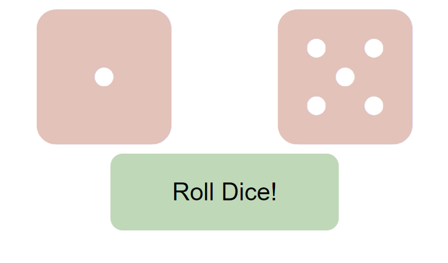

# Roll Dice

Roll a dice! Built with React state.

## Table of contents

- [Overview](#overview)
  - [Screenshot](#screenshot)
  - [Links](#links)
- [My process](#my-process)
  - [Built with](#built-with)
  - [Useful resources](#useful-resources)

## Overview

### Screenshot

### Links

- Live Site URL: [Vercel](https://roll-dice-henna.vercel.app)

## My process

### Built with

- CSS custom properties
- Flexbox
- [React](https://reactjs.org/) - JS library
- React State

### Useful resources

- [Font Awesome](https://fontawesome.com/) - This is a website that contain free image resources. I retrived dice icons from here.
